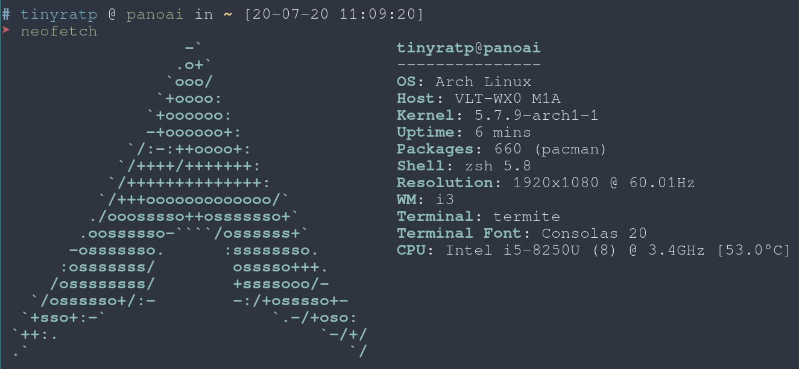

<<<<<<< HEAD
## 
=======
## !!!Warning!!!

### Change the git info.
>>>>>>> a59f4c5... update README.md

It's my git info in `.gitconfig`, you must change it.

```bash
git config --global user.name {{your username}}
git config --global user.email {{your email}}
```

### About mirrors

Because [the GFW](https://en.wikipedia.org/wiki/Great_Firewall), mirrors all is in China.

## How to use my dotfiles?

1. Install [yadm](https://yadm.io/docs/install)
2. ```yadm clone --depth 1 https://github.com/tinyratp/dotfiles.git```
3. ```yadm bootstrap```

## How to install Arch Linux?

just following the guide.

* [Installation Guide](https://wiki.archlinux.org/index.php/installation_guide)
* [Grub](https://wiki.archlinux.org/index.php/GRUB)

